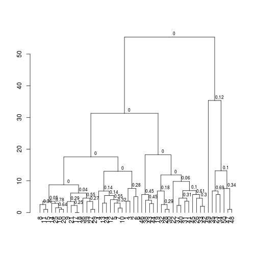
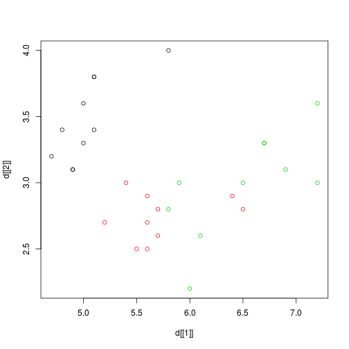
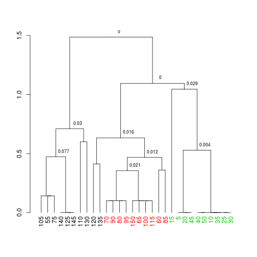

<!-- Do not edit this file directly, rather edit the README.Rmd and build with knitr -->

# Cluster Permutation Test

This clustering algorithm was created by Park et. al.

Park, P. J., Manjourides, J., Bonetti, M., & Pagano, M. (2009). A permutation test for determining significance of clusters with applications to spatial and gene expression data. Computational statistics & data analysis, 53(12), 4290-4300.  

I have simply refactored it.

# Installation


```r
library(devtools)
install_github('arendsee/parkcluster')
```

# Examples


```r
library(parkcluster)
```


```r
?parkcluster
?phclust_plot
?phclust_pvalues
```


```r
phclust_plot(cars)
```

```
## Warning: replacing previous import by 'magrittr::%>%' when loading
## 'dendextend'
```




```r
d <- iris[5*(1:30), c('Sepal.Length', 'Sepal.Width', 'Species')]

plot(d[[1]], d[[2]], col=as.numeric(d$Species))
```




```r
phclust_plot(d[1:2], group=d$Species, cutoff=0.1, nperm=1000)
```

```
##  int [1:2] 9 7
##  int [1:2] 10 5
##  int [1:3] 11 4 8
##  int [1:2] 12 2
##  int [1:3] 14 1 13
##  int [1:3] 15 10 5
##  int [1:2] 16 3
##  int [1:5] 17 6 14 1 13
```


